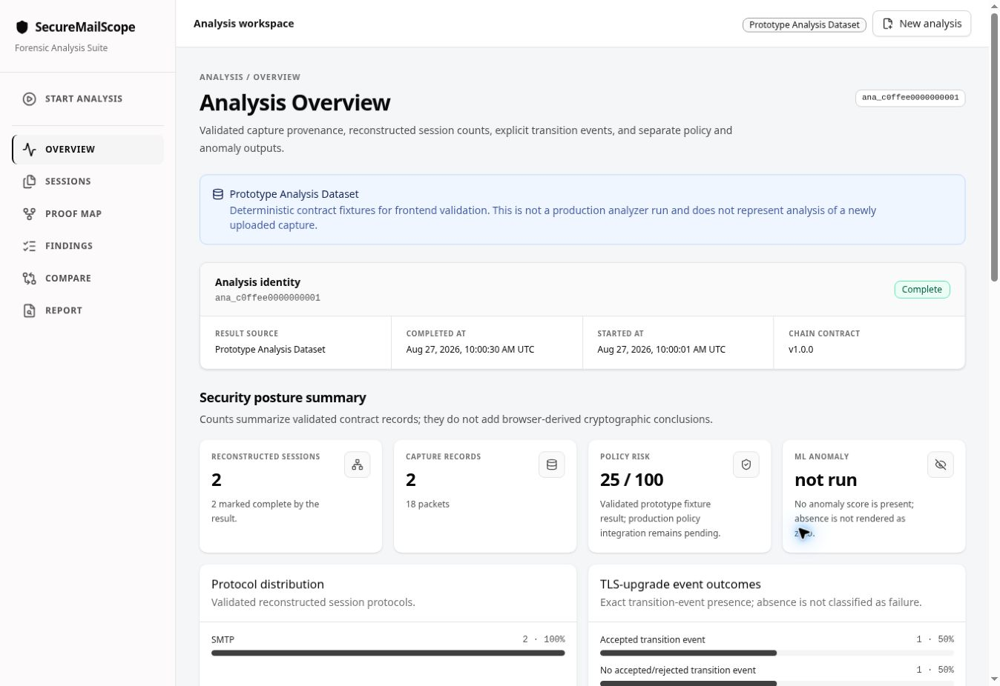
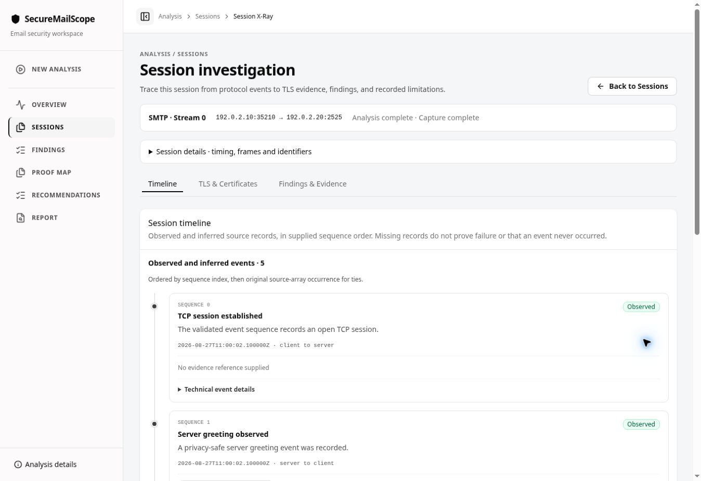
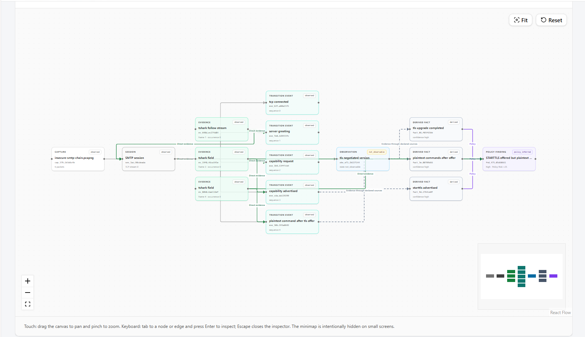
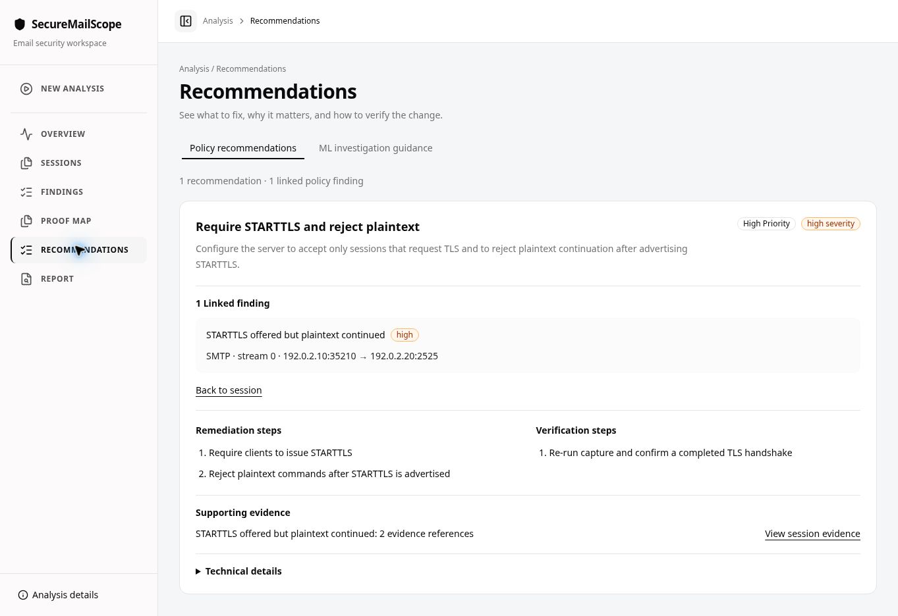

# SecureMailScope

**From captured email traffic to evidence-backed security decisions.**

SecureMailScope is a passive network-forensics project designed to turn authorized PCAP/PCAPNG captures into reconstructed email sessions, explainable cryptographic security findings, packet-linked evidence, and corrective guidance.

It helps SOC analysts, digital-forensics and incident-response teams, and enterprise administrators assess observed email protection and trace conclusions to capture evidence.

Developed by **Team Apex** for **Smart India Hackathon 2026**, **SIH26159 / PS159**: *AI-Assisted Cryptographic Security Posture Assessment for Secure Email Communications*.

**[Explore SecureMailScope](https://secure-mail-scope.vercel.app)**

> **For evaluators:** Select **Explore Demo** to inspect a labelled sample analysis. The demo uses disclosed sample data, not a newly uploaded capture. Production backend development is ongoing.

## Proposed solution and PS159 coverage

The intended solution analyzes **SMTP, IMAP, and POP3** transport from passive captures, reconstructs observable communication, and combines cryptographic policy assessment with independent AI-assisted analysis. Its outputs connect investigation priorities to supporting evidence and practical remediation.

| Capability | Intended assessment and output |
| --- | --- |
| Email protocol identification | Content-supported SMTP, IMAP, and POP3 identification, using ports as supporting hints. |
| Session reconstruction | Ordered TCP streams, email-session activity, and observable TLS handshakes with packet references. |
| Encryption transitions | SMTP/IMAP STARTTLS, POP3 STLS, and implicit TLS; distinguish established, rejected, incomplete, and plaintext-continuation outcomes. |
| Negotiated protection | TLS versions, cipher suites, key-exchange mechanisms, and evidence supporting Forward Secrecy. |
| X.509 assessment | Available certificate extraction; chain validation against an explicit trust basis; capture-time expiration/validity, public-key algorithm and length, and signature-algorithm analysis. |
| Cryptographic weaknesses | Deprecated TLS, weak ciphers or algorithms, certificate issues, and insecure configurations, with policy rationale and severity. |
| AI-assisted analysis | Cryptographic feature extraction, risk classification, anomalous TLS behavior, posture scoring, and threat prioritization; policy results remain distinguishable from ML outputs. |
| Investigation and reporting | Comprehensive posture assessment, prioritized findings, mitigation guidance, an interactive dashboard, and JSON, HTML, and PDF reports. |

## Analyst workflow

The screenshots below show the labelled sample analysis available in the public demo.

<table>
  <thead>
    <tr>
      <th width="33%">Session investigation</th>
      <th width="33%">Proof Map</th>
      <th width="33%">Finding details</th>
    </tr>
  </thead>
  <tbody>
    <tr>
      <td width="33%" align="center" valign="top">
        
      </td>
      <td width="33%" align="center" valign="top">
        
      </td>
      <td width="33%" align="center" valign="top">
        
      </td>
    </tr>
    <tr>
      <td width="33%" align="center" valign="top"><em>Session investigation — protocol observations, TLS upgrade state, and an ordered event timeline.</em></td>
      <td width="33%" align="center" valign="top"><em>Proof Map — connections between packet evidence, session events, derived facts, and policy findings.</em></td>
      <td width="33%" align="center" valign="top"><em>Finding details — severity, supporting evidence, security impact, and corrective guidance.</em></td>
    </tr>
  </tbody>
</table>

- **Traceable conclusions:** findings connect to supporting session events, packet references, policy rationale, and corrective guidance.
- **Explicit limitations:** incomplete or unavailable evidence remains visible; missing visibility is not treated as proof of security.
- **Separate assessments:** deterministic Policy Risk and advisory ML Anomaly remain distinct. Evaluated ML remains planned.

## Implementation status

| Area | Status | Scope |
| --- | --- | --- |
| Analyst interface | **Completed** | Demonstrated sample-analysis workflow: Overview, session investigation, Proof Map, and recommendations. |
| Capture analysis | **Working** | Verified PCAP/PCAPNG intake, hashing, TCP reconstruction, SMTP identification, and STARTTLS transition analysis. |
| Evidence, findings, and reporting | **Working** | Supported evidence models, deterministic findings, Chain JSON, and finding-level HTML/PDF artifacts. |
| Production backend | **In development** | Further backend development and integration. |
| Broader security assessment | **In development** | Full IMAP/POP3 coverage and comprehensive TLS/certificate assessment. |
| Evaluated local ML | **Planned** | Model integration and evaluation. |
| Self-hosted and offline deployment | **Planned** | Docker packaging and deployment verification. |

## Technology stack

| Technology | Version |
| --- | --- |
| Next.js, React | 16.3.8, 19.2.8 |
| TypeScript, Tailwind CSS | 5.9.3, 4.3.3 |
| shadcn CLI, Base UI | 4.19.0, 1.7.0 |
| React Flow, Recharts | 12.11.5, 3.10.1 |
| TanStack React Table, Zustand | 9.2.4, 5.0.15 |
| Zod | 4.5.4 |
| React Dropzone | 20.1.1 |
| Lucide React, Motion | 1.37.0, 13.1.1 |
| Python | 3.12; recorded environment: 3.12.3 |
| FastAPI, Uvicorn | 0.141.1, 0.52.4 |
| Pydantic, jsonschema | 2.13.4, 4.26.0 |
| cryptography | 50.0.0 |
| PyYAML | 6.0.3 |
| python-multipart, Typer | 0.0.32, 0.27.1 |
| Jinja2, ReportLab | 3.1.6, 5.0.1 |
| TShark, capinfos | 4.2.2, 4.2.2 |
| scikit-learn, joblib **(planned ML)** | 1.9.0, 1.5.3 |
| pytest, Ruff | 9.1.1, 0.16.4 |
| Node.js, npm, uv | 22.22.3, 10.9.8, 0.12.5 |

## Repository structure

The analysis design separates Python/TShark packet processing, Chain-of-Proof evidence, deterministic policy, and planned independent ML. Reporting and the Next.js interface consume structured results; production integration is ongoing.

| Path | Contents |
| --- | --- |
| [web/](web/) | Next.js interface |
| [src/securemailscope/](src/securemailscope/) | Python analysis core |
| [schemas/](schemas/) | Evidence contract |
| [tests/](tests/) | Validation tests |
| [docs/](docs/) | Technical documentation |
| [context/](context/) | Architecture and progress |

## Deployment direction

SecureMailScope is being developed toward self-hosted operation with Docker packaging so organizations can investigate captures within their own environment. Offline operation remains a target requiring locally available resources and end-to-end verification with networking disabled; deployment documentation will accompany a verified release.

Built by Team Apex for SIH 2026
