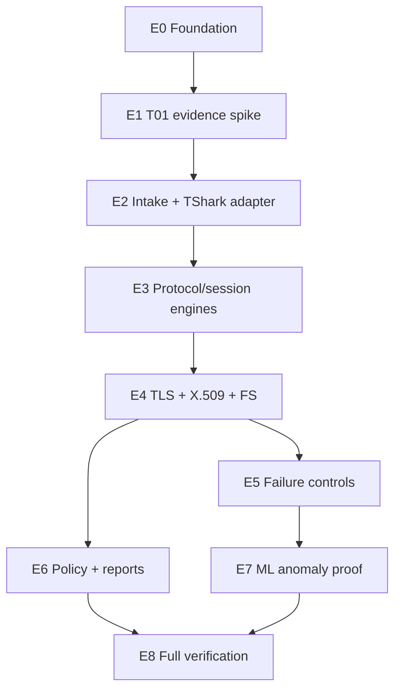

# SecureMailScope POC — Feature Breakdown and Execution Backlog

## 1. Purpose

This document converts the PRD and system design into buildable, testable work units. It is the execution backlog for the one-day technical POC, not a list of attractive optional features.

Rules:

- Work in dependency order.
- Complete independent ground truth before analyzer implementation for that fixture.
- Stop at hard checkpoints instead of moving to polish with a broken core.
- A checked item means implemented and verified, not merely generated by AI.
- Update actual status and runtime in `context/progress-tracker.md` and final evidence in `docs/POC_RESULT.md`.

## 2. Priority model

| Priority | Meaning |
|---|---|
| P0 | Mandatory technical gate; one failure forces RED |
| P1 | Required support for reproducibility/credible demo |
| P2 | Useful only if every P0/P1 item is complete |
| Deferred | Final-solution requirement intentionally outside POC |

## 3. Dependency map

## 4. Eight-hour execution summary

| Time | Epic | Hard output |
|---|---|---|
| 00:00–00:30 | E0 | Ready environment and repository checks |
| 00:30–01:30 | E1 | T01 controlled PCAP, truth, and manual evidence |
| 01:30–02:45 | E2/E3A | Generic intake/TShark wrapper and SMTP path |
| 02:45–03:30 | E3B/E3C | IMAP and POP3 fixtures/state machines |
| 03:30–04:45 | E4 | TLS/X.509/FS plus TLS 1.3 honesty |
| 04:45–05:30 | E5 | Weak/broken/truncated/negative controls |
| 05:30–06:30 | E6 | Policy, evidence integrity, JSON, HTML |
| 06:30–07:15 | E7 | Separate deterministic ML proof |
| 07:15–08:00 | E8 | Two full runs and `POC_RESULT.md` |

The target is aggressive. Installation problems are recorded; mandatory gates are not removed to preserve the clock.

## 5. Epic E0 — Repository and environment foundation

**Priority:** P1  
**Gates supported:** all  
**Time target:** 30 minutes

### E0-F1 Repository context

- [ ] Six context files are present and read.
- [ ] Verbatim official statement, PRD, system design, feature breakdown, tooling record, and master prompt are present.
- [ ] Git repository uses `main`; first documentation-only commit exists.
- [ ] `.gitignore` excludes `.venv`, caches, output, key logs, and private fixture keys.

Acceptance:

- An AI starting from the repository can state the current phase and next step without prior chat history.
- Git status is clean before implementation.

### E0-F2 Locked Python project

- [ ] Install/verify `uv`.
- [ ] Initialize Python 3.12 project without overwriting context/docs.
- [ ] Add runtime and development dependencies.
- [ ] Commit `pyproject.toml` and `uv.lock`.
- [ ] Verify `uv sync --locked` and `uv run python --version`.

Acceptance:

- A clean clone can recreate the same dependency resolution from `uv.lock`.

### E0-F3 System prerequisites

- [ ] Install/verify TShark 4.2+, OpenSSL 3.x, and tcpdump or dumpcap.
- [ ] Record versions.
- [ ] Query required TShark display fields.
- [ ] Verify controlled loopback capture permission.

Acceptance:

- `doctor` or equivalent machine-readable check reports ready.
- Missing fields/tools produce a precise blocker.

## 6. Epic E1 — T01 SMTP evidence spike

**Priority:** P0  
**Gates:** G01–G07, G09 foundation  
**Time target:** 60 minutes after E0  
**Hard checkpoint:** 90 minutes total from ready environment

### E1-F1 Controlled PKI

- [ ] Generate disposable controlled root CA and SMTP server certificate.
- [ ] Certificate is valid at capture time and matches the controlled hostname/SNI.
- [ ] Record certificate fingerprint, fields, chain, key/signature algorithms, validity, and file hashes independently.
- [ ] Private key has restricted permissions and is Git-ignored.

Acceptance:

- `openssl verify -CAfile ... -attime ...` succeeds.
- Manifest facts match certificate-file inspection.

### E1-F2 Controlled SMTP STARTTLS endpoint

- [ ] Server listens on loopback port 2525.
- [ ] SMTP banner/EHLO/capability/STARTTLS/220 flow is logged.
- [ ] Client sends STARTTLS across at least two controlled writes/segments.
- [ ] TLS is forced to 1.2 with an installed-supported ECDHE suite.
- [ ] Endpoint log records exact negotiated version/cipher and timestamps.

### E1-F3 Capture and truth

- [ ] Capture connection start through clean close.
- [ ] Save `smtp_tls12_valid.pcapng`.
- [ ] Pin PCAP/log/cert hashes and expected facts in `ground_truth.json`.
- [ ] Do not use analyzer output in truth generation.

### E1-F4 Manual proof

- [ ] TShark discovers the stream without protocol/port being supplied by the user.
- [ ] Follow-stream evidence proves SMTP grammar and split command reconstruction.
- [ ] Ordered frames prove STARTTLS -> 220 -> ClientHello.
- [ ] ServerHello proves TLS 1.2 and selected cipher.
- [ ] Handshake evidence supports ECDHE/group and FS=`yes`.
- [ ] Certificate bytes/fingerprint/properties match controlled files.

Checkpoint decision:

- **CONTINUE** only if every T01 fact agrees.
- **RED/BLOCKED** if the complete evidence chain cannot be established after ordinary setup corrections.

## 7. Epic E2 — Generic intake and TShark adapter

**Priority:** P0/P1  
**Gates:** G03–G05, G11  
**Time target:** 35 minutes

### E2-F1 Typed models

- [ ] Define protocol/outcome/observability/FS/reconstruction enums.
- [ ] Define capture provenance, raw observation, evidence, session, TLS, certificate, finding, policy score, anomaly score, and report models.
- [ ] Add referential-integrity validation for finding evidence IDs.

### E2-F2 Capture intake

- [ ] Validate generic PCAP path.
- [ ] Hash input by streaming.
- [ ] Record size, capture interval, packet count, and versions.
- [ ] Return typed errors for bad input.

### E2-F3 Safe TShark wrapper

- [ ] Argument-list subprocess execution with timeout.
- [ ] Two-pass discovery query.
- [ ] Multiple field occurrences preserved.
- [ ] Stage/runtime/exit/stderr diagnostics captured safely.
- [ ] Protocol-aware second pass supports the classifier-selected server endpoint.

Acceptance:

- No fixture path/port/stream/frame is hardcoded.
- T01 raw observations retain exact source frames/fields.

## 8. Epic E3 — Protocol identification and upgrade sessions

**Priority:** P0  
**Gates:** G01–G04  
**Time target:** 85 minutes total

### E3A SMTP path

- [ ] Direction-consistent classifier requires two SMTP signatures.
- [ ] SMTP upgrade state machine implements all required outcomes.
- [ ] Segmented STARTTLS reconstructs.
- [ ] T01 integration test matches truth.

### E3B IMAP T02

- [ ] Controlled non-standard-port IMAP fixture and endpoint truth.
- [ ] Classifier requires `* OK`/capability plus tagged grammar.
- [ ] State machine matches request tag to tagged `OK`.
- [ ] ClientHello must follow on same stream.
- [ ] Integration test matches TLS/session/certificate truth.

### E3C POP3 T03

- [ ] Controlled non-standard-port POP3 fixture and endpoint truth.
- [ ] Classifier requires `+OK`/`-ERR` plus POP3 grammar.
- [ ] STLS -> `+OK` -> ClientHello state machine.
- [ ] Integration test matches TLS/session/certificate truth.

### E3D Negative protocol behaviour

- [ ] Insufficient/contradictory signatures produce `unknown`.
- [ ] Ports never decide protocol.

Checkpoint:

- Continue only when SMTP/IMAP/POP3 and all three successful upgrade mechanisms pass controlled truth.

## 9. Epic E4 — TLS, Forward Secrecy, and X.509

**Priority:** P0  
**Gates:** G04–G08  
**Time target:** 75 minutes

### E4-F1 TLS timeline and negotiated facts

- [ ] Ordered observable handshake events with directions/frames.
- [ ] Reconstruction level computed.
- [ ] TLS 1.2 version/cipher/key-exchange/group normalized.
- [ ] TLS 1.3 version comes from `supported_versions`.
- [ ] TLS 1.3 key establishment uses key-share/PSK evidence.

### E4-F2 Forward Secrecy

- [ ] ECDHE/key-share -> `yes` with evidence.
- [ ] Static RSA/PSK-only controlled case -> `no`.
- [ ] Insufficient evidence -> `unknown`.
- [ ] Negative test prevents TLS 1.3 cipher-name inference.

### E4-F3 Observable X.509

- [ ] Extract DER chain and fingerprint.
- [ ] Parse subject/issuer/SAN/validity/key/signature facts.
- [ ] Capture-time chain verification against explicit CA.
- [ ] Identity verification only with observed SNI.
- [ ] Distinct validation failure codes.

### E4-F4 T04 TLS 1.3 honesty

- [ ] Controlled TLS 1.3 SMTP fixture without key log.
- [ ] Correct visible version/cipher/key-share/FS.
- [ ] Certificate state exactly `not_observable_encrypted_tls13`.
- [ ] Validation `not_testable`.
- [ ] No certificate weakness finding.

Checkpoint:

- Any wrong, guessed, or dishonest cryptographic value is a RED signal.

## 10. Epic E5 — Weak, broken, incomplete, and negative controls

**Priority:** P0  
**Gates:** G01–G09  
**Time target:** 45 minutes

### E5-F1 T05 controlled weak configuration

- [ ] Deprecated TLS/static RSA/no-FS configuration.
- [ ] Expired and deliberately weak observable certificate; ground truth covers public-key algorithm/length and signature algorithm.
- [ ] Independent endpoint/certificate truth.
- [ ] Exact normalized values and expected finding codes.

### E5-F2 T06 upgrade/capture failures

- [ ] Rejected upgrade case.
- [ ] Accepted-but-no-ClientHello or plaintext-after-accept case.
- [ ] Truncated capture derived from a known complete fixture with hash/truncation record.
- [ ] No unavailable TLS/certificate values invented.

### E5-F3 T07 misleading-port negative control

- [ ] Non-mail TLS placed on a mail-like port.
- [ ] Protocol remains `unknown`.
- [ ] No STARTTLS/STLS result or mail finding generated.

## 11. Epic E6 — Evidence-backed policy and reports

**Priority:** P0  
**Gates:** G09–G11  
**Time target:** 60 minutes

### E6-F1 Evidence integrity

- [ ] Stable evidence IDs.
- [ ] Raw and normalized values retained.
- [ ] Derived evidence references observed sources.
- [ ] Report validation rejects nonexistent evidence references.

### E6-F2 Policy findings and recommendations

- [ ] Versioned rules for controlled weaknesses.
- [ ] Finding code, severity, rationale, evidence, standards, mitigation.
- [ ] Deterministic priority ordering.
- [ ] Transparent policy-risk and posture calculations.
- [ ] Unknown/not-observable states suppress invalid findings.

### E6-F3 Canonical JSON

- [ ] Report model serialization.
- [ ] Versioned JSON Schema.
- [ ] Schema validation before success.
- [ ] Deterministic semantic ordering.

### E6-F4 Minimal HTML

- [ ] Render only from saved canonical JSON.
- [ ] Show provenance, sessions, upgrade, TLS, certificate, findings, evidence, both scores, and limitations.
- [ ] Accessible labels; no colour-only status.
- [ ] Semantic parity test with JSON.

## 12. Epic E7 — T08 ML anomaly proof

**Priority:** P0 because official POC gate requires it  
**Gate:** G10  
**Time target:** 45 minutes

### E7-F1 Controlled corpus

- [ ] 12 normal training sessions with bounded legitimate variation.
- [ ] 2 held-out normal sessions.
- [ ] 2 controlled anomaly sessions: downgrade/no-FS and broken/unusual handshake.
- [ ] PCAP hashes and split roles pinned.

### E7-F2 Feature contract

- [ ] Versioned fixed feature names/order/types.
- [ ] Missing-value treatment frozen.
- [ ] Policy outputs explicitly excluded.
- [ ] Input feature vector included in report.

### E7-F3 Model and test

- [ ] IsolationForest `random_state=159`.
- [ ] Train only on 12 normal sessions.
- [ ] Freeze model, preprocessing, threshold, hashes.
- [ ] Both anomalies score above both held-out normals.
- [ ] Repeated runs produce identical scores/classifications.
- [ ] Report labels score as non-probabilistic behavioural anomaly.

## 13. Epic E8 — Final verification and decision

**Priority:** P0  
**Gates:** G01–G11  
**Time target:** 45 minutes

- [ ] Run Ruff check and format check.
- [ ] Run all tests.
- [ ] Run T01–T08 end to end twice from clean output directories.
- [ ] Validate PCAP/log/cert/model hashes.
- [ ] Validate JSON Schema.
- [ ] Validate every finding evidence reference.
- [ ] Validate JSON/HTML semantic parity.
- [ ] Record per-stage and total runtime.
- [ ] Record warnings, deviations, failures, and blockers.
- [ ] Complete `docs/POC_RESULT.md`.
- [ ] Issue GREEN only if G01–G11 all pass; otherwise RED.

## 14. POC result document checklist

`POC_RESULT.md` must include:

- environment and exact versions;
- repository commit hash;
- commands to generate/verify fixtures;
- commands to run analyzer/tests;
- PCAP/log/cert/model/rule/schema hashes;
- T01–T08 actual versus expected results;
- G01–G11 binary checklist;
- representative frame/stream/field evidence;
- JSON/HTML output locations;
- first and second full-run runtimes;
- failed tests and unresolved discrepancies;
- architecture/scope deviations and impact;
- blockers and workarounds;
- decisive GREEN/RED with rationale;
- what would remain for the five-to-six-day full build.

## 15. Tooling feature timing

| Tool feature | When introduced | Why |
|---|---|---|
| `uv` lock/environment | E0 | Reproducibility before code |
| Ruff/pytest | E0/E2 | Fast local feedback |
| pre-commit (conditional) | After first checks work, if quick | Prevent trivial bad commits without blocking setup |
| GitHub Actions (conditional) | After T01/local tests pass, if useful | Independent repeatability; avoid debugging CI before core truth |
| CodeRabbit (conditional) | First meaningful analyzer PR, if installed | Secondary review of boundaries/errors/tests |
| `pip-audit` (recommended) | E8 or after baseline, if time permits | Dependency audit; not a replacement for protocol tests |

## 16. Deferred feature backlog after GREEN

- FastAPI analysis/upload/job API.
- Interactive Next.js/React security dashboard.
- PDF export.
- Broader PCAP/pcapng/link-layer/malformed-input coverage.
- Real enterprise data evaluation and explainable ML validation.
- Job persistence/object storage and access controls.
- Deployment, performance/load testing, operational logging/metrics.
- Report filtering, evidence drill-down, comparison/trend views.
- Accessibility and polished demo workflows.

Do not pull deferred features into the POC unless every P0 gate is already complete and the change cannot risk the final verification window.
