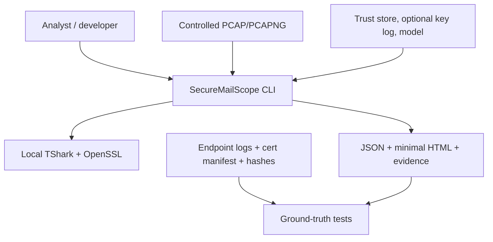
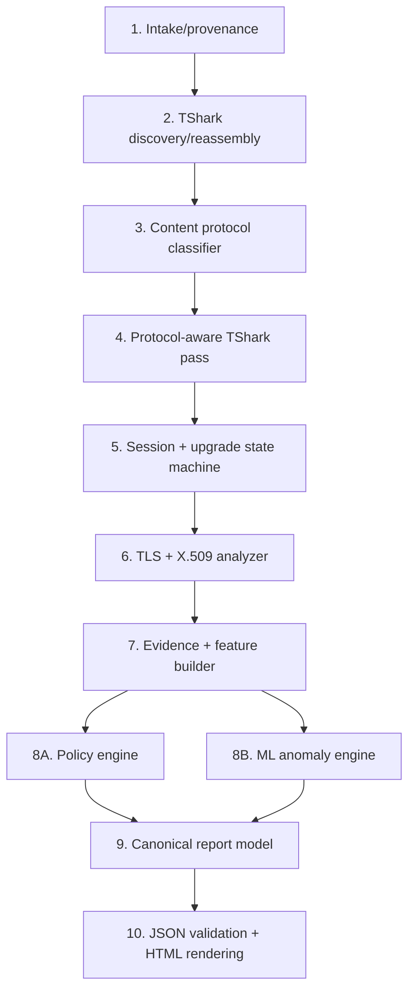
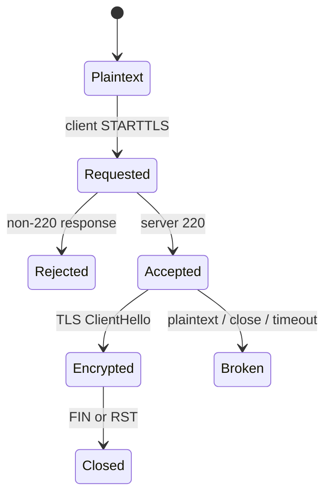
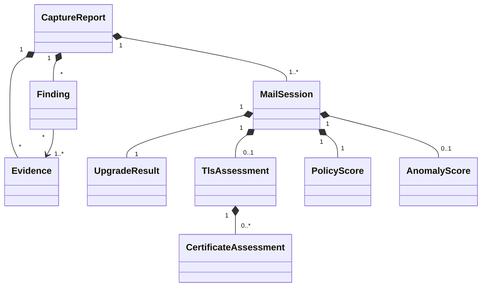
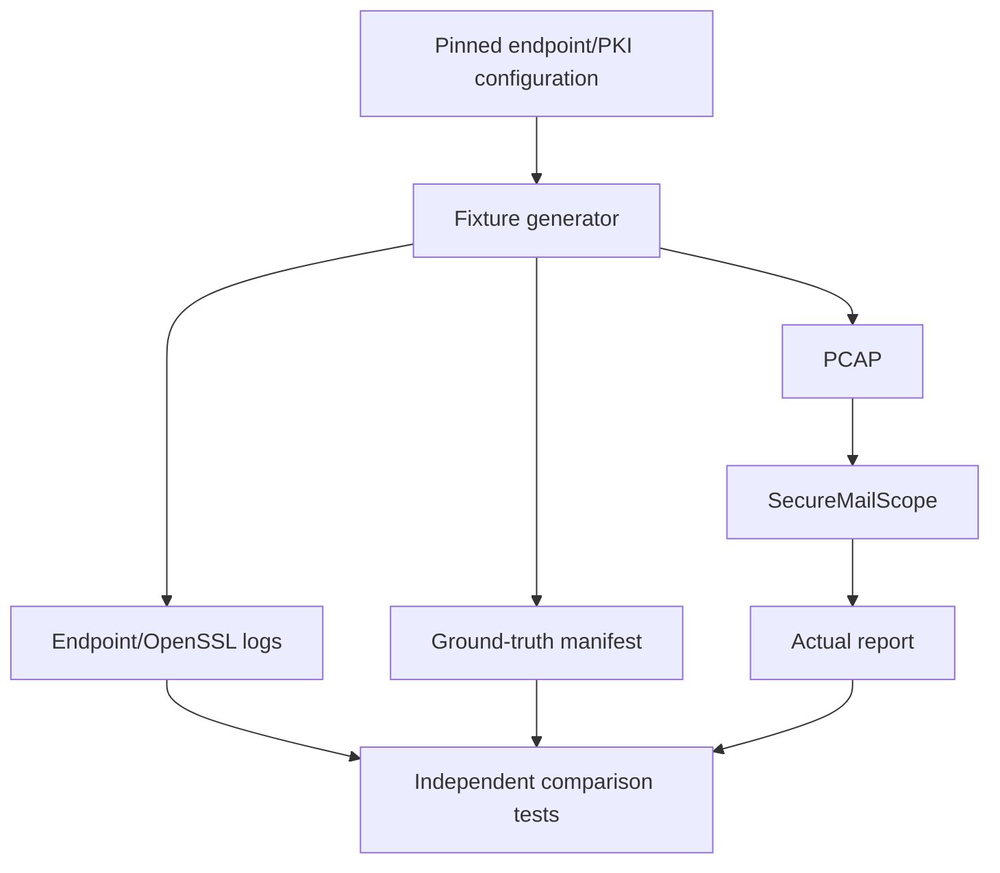

# SecureMailScope POC — System Design

## 1. Design status and scope

This document defines the architecture for the one-day PS159 technical POC. It is required because correctness depends on maintaining clear boundaries between packet dissection, protocol/session state, cryptographic interpretation, evidence, deterministic policy, ML anomaly detection, and reporting.

The design is frozen for implementation unless a controlled experiment disproves an assumption. Any change to a gate, observability rule, or ground-truth contract must be recorded in `docs/POC_RESULT.md`.

## 2. Design goals

- Correctly analyze controlled PCAP/PCAPNG files without building a TCP stack.
- Make every important result traceable to packet/certificate evidence.
- Make unknown, encrypted, missing, and incomplete information unambiguous.
- Keep policy and anomaly logic independent.
- Remain small enough for one focused day.
- Preserve a framework-neutral core reusable behind a later API/dashboard.

## 3. Constraints

- One primary developer.
- Approximately eight focused hours for the POC.
- Offline input only; no product live capture.
- TShark/OpenSSL are external local binaries.
- TLS application data normally remains encrypted.
- TLS 1.3 post-ServerHello handshake messages, including Certificate, are encrypted without secrets.
- Controlled fixtures must establish independent ground truth.
- JSON and minimal HTML only during POC.

## 4. System context



External tools supply observations and independent verification. SecureMailScope owns classification, normalization, state machines, evidence linking, policy, ML integration, and reporting.

## 5. High-level processing architecture



The report model is the only input to the HTML renderer. The ML branch cannot modify policy findings or their evidence.

## 6. Runtime topology

The POC is a single local Python process that launches bounded subprocesses:

```text
securemailscope process
  ├── tshark discovery subprocess
  ├── tshark protocol-aware subprocess(es)
  ├── optional tshark key-log-assisted subprocess
  └── openssl verification subprocess(es)
```

No server, queue, database, container, or network dependency is required for analysis. Fixture capture is a separate local development script and is never invoked implicitly by `analyze`.

## 7. Repository architecture

```text
SecureMailScope/
  .gitignore
  .python-version
  MASTER_PROMPT.md
  README.md
  context/
    project-overview.md
    architecture.md
    code-standards.md
    rules.md
    ui-context.md
    progress-tracker.md
  docs/
    OFFICIAL_PS159.md
    PRD.md
    SYSTEM_DESIGN.md
    FEATURE_BREAKDOWN.md
    TOOLING.md
    POC_RESULT.md              # generated during final verification
  src/securemailscope/
    __init__.py
    cli.py
    pipeline.py
    models.py
    errors.py
    tooling.py
    intake.py
    tshark.py
    protocols.py
    sessions.py
    crypto.py
    certificates.py
    evidence.py
    features.py
    policy.py
    anomaly.py
    reporting.py
  scripts/
    generate_fixtures.py
    train_anomaly_model.py
  fixtures/
    ground_truth.json
    pcaps/
    endpoint_logs/
    pki/
    keylogs/
    evidence/
  policy/rules.yml
  schemas/report.schema.json
  templates/report.html.j2
  models/
  tests/
    conftest.py
    test_protocols.py
    test_sessions.py
    test_crypto.py
    test_policy.py
    test_anomaly.py
    test_pcap_matrix.py
    test_reporting.py
  pyproject.toml
  uv.lock
```

This is the canonical POC layout. Do not rename or combine these modules merely for convenience; change the tree only when a measured blocker is recorded in `context/progress-tracker.md` and the architecture documents are updated together.

## 8. Component design

### 8.1 CLI

Responsibilities:

- Parse paths/options.
- Call prerequisite and input validation.
- Run the orchestration service.
- Print output paths and concise status.
- Return defined exit codes.

Planned commands:

```text
securemailscope doctor
securemailscope analyze INPUT [OPTIONS]
securemailscope validate-report REPORT.json
```

The CLI contains no packet parsing, policy rules, or HTML-specific facts.

### 8.2 Analysis pipeline

- Sequence intake, discovery, classification, protocol-aware extraction, session reconstruction, cryptographic analysis, policy, anomaly, and reporting stages.
- Record stage runtimes and typed failures.
- Preserve valid stream results when one stream fails and safe continuation is possible.
- Contain no protocol signatures, cryptographic rules, policy conditions, ML preprocessing, or presentation logic.

### 8.3 Tooling/prerequisite layer

- Resolve TShark/OpenSSL executables.
- Record versions and supported display-field spellings.
- Run subprocesses with `shell=False`, timeout, bounded output, and sanitized diagnostics.
- Fail early when mandatory fields/tools are unavailable.

### 8.4 Intake

- Resolve/validate input path.
- Stream SHA-256 calculation.
- Obtain capture metadata through TShark.
- Establish immutable `CaptureProvenance`.
- Never write to the input capture.

### 8.5 TShark adapter

Use TShark rather than a Python packet-wrapper abstraction so commands, fields, versions, and stderr remain explicit and reproducible.

Discovery pass:

```text
tshark -2 -r INPUT ...
```

`-2` enables two-pass analysis, allowing fields that require future knowledge and correct reassembly frame dependencies. Use machine-readable JSON or field-delimited output with explicit `-e` selections; never parse human column text when a display field exists.

Responsibilities:

- Construct safe commands.
- Capture raw observations with field name and frame.
- Preserve multiple field occurrences.
- Normalize tool errors without suppressing stderr evidence.
- Support decode-as only after content classification identifies a server endpoint.

### 8.6 Protocol classifier

Input: stream endpoints, directions, reassembled safe plaintext prefixes/commands, and protocol fields when available.

Output:

```text
protocol: smtp | imap | pop3 | unknown
confidence_basis: list of matched signatures
server_endpoint
client_endpoint
evidence_ids
```

Rules:

- Minimum two independent signatures.
- Direction must be consistent.
- Ports contribute no decisive signature.
- Ambiguous/contradictory input becomes `unknown`.

### 8.7 Session and upgrade state machines

The state builder consumes ordered reassembled application/TLS events on one `tcp.stream`.

SMTP simplified states:



IMAP matches the request tag to the tagged `OK`. POP3 uses `STLS` and `+OK`. Capture gaps may move any uncertain outcome to `capture_incomplete`; they must not manufacture rejection or success.

### 8.8 TLS analyzer

Input: ordered raw TShark TLS observations with evidence references.

Output:

- observable handshake event timeline;
- negotiated version;
- selected cipher suite;
- key-establishment mechanism and group;
- Forward Secrecy result plus reasoning;
- reconstruction level;
- alerts/failures/incompleteness;
- certificate observability state.

Version rules:

- TLS 1.3: selected ServerHello `supported_versions` wins over legacy version.
- TLS 1.2 and earlier: use negotiated ServerHello version and selected suite.

Key-establishment rules:

- TLS 1.2 and earlier: map selected suite to key-exchange family and confirm with handshake fields where present.
- TLS 1.3: use selected `key_share`, PSK selection, and PSK exchange-mode evidence; the cipher identifies record protection only.

FS rules:

```text
observed ephemeral (EC)DHE/key_share -> yes
observed static RSA or PSK-only psk_ke -> no
missing/ambiguous required evidence -> unknown
```

### 8.9 Certificate analyzer

When certificate bytes are observable:

1. Extract DER byte sequences and source frames.
2. Calculate SHA-256 fingerprints.
3. Parse subject, issuer, SAN, validity, key algorithm/size, signature algorithm, constraints, and chain order.
4. Verify chain at capture time against the user-supplied CA store.
5. Verify hostname only with observed SNI/expected identity.
6. Record analysis-time status separately.

When a passive TLS 1.3 Certificate message is encrypted and no usable secrets exist, produce:

```json
{
  "observability": "not_observable_encrypted_tls13",
  "validation": "not_testable",
  "reason": "server certificate message encrypted after ServerHello"
}
```

No certificate weakness rule may fire from that state.

### 8.10 Evidence builder

Evidence is immutable after creation. Stable IDs should derive from stable inputs such as capture hash, stream, frame set, source field, and occurrence—not list position alone.

Required source types:

- `tshark_field`
- `reassembled_stream_bytes`
- `certificate_der`
- `openssl_verification`
- `derived_rule`

Derived evidence references the observed evidence used in derivation.

### 8.11 Policy engine

Inputs: normalized facts and evidence only.

Rules are versioned data/configuration where feasible:

```text
rule code
condition over normalized facts
severity
rationale template
standards references
recommendation
score contribution
```

Rules must define whether unknown/not-observable states suppress a finding. A rule cannot treat missing evidence as proof of insecurity unless the finding itself is explicitly about capture/configuration incompleteness and has supporting evidence.

### 8.12 Feature and anomaly engine

Candidate feature groups:

- protocol category;
- STARTTLS outcome;
- negotiated TLS version/cipher category;
- key-establishment category and FS;
- handshake event counts/timing/completeness;
- alert/failure counts;
- certificate observability and stable fingerprint behaviour;
- packet/byte/session-duration summaries;
- JA3/JA3S only when TShark exposes them reliably.

The preprocessing contract fixes feature names/order/types/missing-value treatment. Train on 12 controlled normal sessions only. Evaluate on 2 held-out normals and 2 known anomalies. Freeze `random_state=159`, threshold, preprocessing, training hashes, and model hash.

ML cannot create or remove deterministic policy findings.

### 8.13 Report builder

Pipeline:

```text
validated Pydantic Report
  -> deterministic JSON serialization
  -> JSON Schema validation
  -> read the saved canonical JSON
  -> render minimal HTML
  -> semantic parity test
```

The renderer does not receive raw analyzer internals.

## 9. Core domain model



Important enums:

```text
MailProtocol = smtp | imap | pop3 | unknown
UpgradeOutcome = success | rejected | accepted_no_tls | plaintext_after_accept |
                 not_attempted | capture_incomplete
Observability = observed | derived_from_observed |
                not_observable_encrypted_tls13 | not_present |
                not_applicable | capture_incomplete |
                unknown_insufficient_evidence
ForwardSecrecy = yes | no | unknown
ReconstructionLevel = fully_parsed_with_secrets |
                      passive_visible_reconstruction | partial_capture
```

## 10. Ground-truth architecture



The analyzer package must not be importable by the truth generator. The generator may parse its own OpenSSL/endpoint results, but never actual report output.

Manifest minimum per fixture:

- ID/generator version;
- PCAP hash/size/time/session count;
- endpoints and verified stream association;
- transcript/log hash;
- protocol and transition truth;
- TLS/cipher/key establishment/group/FS truth;
- reconstruction truth;
- certificate file hash/properties/chain/validation truth;
- expected and forbidden finding codes;
- expected unknown/not-observable states;
- ML split/cause.

## 11. Error model

| Error category | Example | Behaviour |
|---|---|---|
| Prerequisite | TShark missing/unsupported field | Fail before analysis with installation/version detail |
| Input | Missing/malformed PCAP | Non-zero exit; no report falsely marked complete |
| Tool execution | Timeout/non-zero exit | Typed stage error with bounded stderr |
| Capture quality | Truncation/gap/missing beginning | Preserve partial session and `capture_incomplete` |
| Unsupported observation | Unknown protocol/field unavailable | Explicit unknown reason; no guess |
| Validation | Schema/evidence-reference mismatch | Fail report generation; do not emit misleading final report |
| Per-stream parse | One corrupt stream among valid streams | Record bounded stream error when safe and continue other streams |

Proposed exit codes:

```text
0 analysis completed (findings may exist)
2 invalid CLI/input
3 prerequisite/tooling failure
4 analysis/reconstruction failure
5 report/schema/evidence-integrity failure
```

## 12. Security and privacy design

- No network calls in the analyzer path.
- Never send real/sensitive PCAPs, private keys, key logs, credentials, or sensitive output to AI/code-review services. A repository-connected service may access only a committed controlled synthetic PCAP that has first been confirmed non-sensitive.
- Redact credentials and email content at ingestion; do not rely only on template redaction.
- Use least-privilege capture only in fixture generation.
- Do not run analyzer code with root privileges.
- Controlled private keys are disposable, permission-restricted, ignored by Git, and excluded from reports.
- Validate paths and never construct shell commands from user strings.
- Limit stored raw evidence to fields/bytes required for proof.
- Hash immutable evidence and record tool versions.

## 13. Determinism and versioning

Version independently:

- analyzer;
- report schema;
- policy rules;
- protocol classifier signatures;
- TLS normalization lookup;
- ML feature schema/preprocessing;
- ML model/threshold;
- fixture generator and truth manifest.

Sort sessions, findings, evidence, and certificates deterministically. Runtime/timestamp metadata may vary but must be clearly separated from semantic comparison.

## 14. Performance design

- Select explicit TShark fields rather than retaining complete decoded JSON where possible.
- Stream file hashing.
- Group work by `tcp.stream`.
- Avoid copying full packet payload into evidence.
- Cache immutable TShark pass results within one run only.
- Record subprocess and component runtimes.
- Do not add parallelism unless measurement shows it is needed; deterministic simplicity is more valuable for the POC.

## 15. Testing architecture

Test layers:

1. Unit tests for normalization, state transitions, FS logic, observability, score/rule evaluation, and models.
2. Adapter tests using pinned small TShark output samples.
3. PCAP integration tests T01–T07 against independent manifest truth.
4. ML pipeline test T08 with fixed hashes/seed.
5. Report schema/evidence referential-integrity tests.
6. JSON/HTML parity test.
7. Full matrix repeated twice with runtime recording.

Tests must include expressly forbidden outputs, especially:

- no port-only classification;
- no success on rejected/broken upgrade;
- no invented TLS value in truncated capture;
- no certificate finding for secretless TLS 1.3;
- no policy score used as an ML feature.

## 16. CI design

If enabled after the first working local checkpoint, GitHub Actions runs on pushes/PRs to:

- install locked Python environment;
- install or verify TShark/OpenSSL versions;
- run Ruff check/format check;
- run unit/integration tests on committed controlled PCAPs;
- validate JSON Schema and evidence references;
- run dependency audit as non-blocking until baseline is understood, then block known actionable vulnerabilities.

CI analyzes existing fixtures; it does not need live capture privileges or generate new truth. CI is a reproducibility aid, not a substitute for local controlled evidence and not a standalone POC gate.

## 17. Architecture decisions

| Decision | Choice | Reason |
|---|---|---|
| Packet engine | TShark subprocess | Mature reassembly/dissectors and explicit reproducibility |
| Language | Python 3.12 | Best fit for crypto/ML/report pipeline and timebox |
| Dependency workflow | `uv` + `pyproject.toml` + committed `uv.lock` | Fast isolated setup and exact reproducible resolution |
| Ground truth | Controlled endpoints + OpenSSL logs/manifests | Independent known facts |
| Policy vs ML | Two separate engines/scores | Prevent circular or misleading risk claims |
| Canonical output | JSON | Stable machine contract and source for HTML/API |
| POC UI | Static Jinja2 HTML | Meets minimal proof without frontend scope |
| TCP handling | TShark reassembly | Custom TCP stack is infeasible and unnecessary |
| AI review | Optional CodeRabbit after core PR | Secondary review only; cannot validate packet truth |

## 18. Open technical questions resolved by the first spike

- Exact TShark display-field names in the installed version.
- Whether controlled split STARTTLS is visibly reassembled as required on the selected capture setup.
- Exact locally supported TLS 1.2 ECDHE suite/group selected by OpenSSL.
- Certificate extraction representation and frame association from that TShark version.
- Reliable completeness/gap indicators available for the fixture pattern.

These are experiments, not decisions to guess in advance. T01 exists to resolve them before generalized implementation.

## 19. Primary references

- [TShark manual](https://www.wireshark.org/docs/man-pages/tshark.html)
- [RFC 3207 — SMTP STARTTLS](https://www.rfc-editor.org/rfc/rfc3207.html)
- [RFC 2595 — IMAP STARTTLS and POP3 STLS](https://www.rfc-editor.org/rfc/rfc2595.html)
- [RFC 8446 — TLS 1.3](https://www.rfc-editor.org/rfc/rfc8446.html)
- [RFC 9325 / BCP 195](https://www.rfc-editor.org/rfc/rfc9325.html)
- [OpenSSL verify](https://docs.openssl.org/3.0/man1/openssl-verify/)
- [cryptography X.509 reference](https://cryptography.io/en/latest/x509/)
- [Pydantic JSON Schema](https://docs.pydantic.dev/latest/concepts/json_schema/)
- [IsolationForest](https://scikit-learn.org/stable/modules/generated/sklearn.ensemble.IsolationForest.html)
